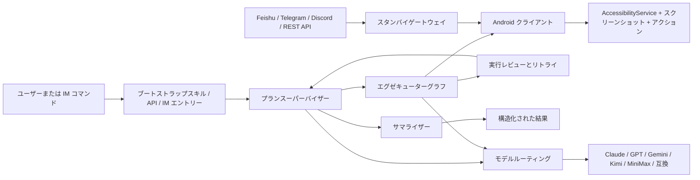

<p align="center">
  <strong>言語:</strong> <a href="./README.md">English</a> | <a href="./README.zh-CN.md">简体中文</a> | <a href="./README.ja-JP.md">日本語</a>
</p>

<p align="center">
  
</p>

<p align="center">
  <a href="#deepseek-harnessでopenguiを使う"></a>
  <a href="./skills/open-gui-bootstrap/SKILL.md"></a>
  
  
  
  <a href="./docs/get-started.ja-JP.md"></a>
</p>

<p align="center">
  <strong>Android 向けのモバイル GUI エージェントフレームワーク。</strong>
</p>

<p align="center">
  OpenGUI は、AI エージェントが実機上の Android アプリ UI を見て、理解し、操作できるようにします。
</p>

<p align="center">
  <strong>推奨：DeepSeek HarnessでOpenGUIを直接使えます。</strong><br>
  Codexに1つのプロンプトを送るだけで、検証済みプラグインのダウンロード、DSHへのインストール、DSHの起動まで進みます。バックエンド一式のデプロイは不要です。
</p>

## OpenGUI-Plus 強化版の追加機能

OpenGUI-Plus は単なるリネームではありません。OpenGUI の Android GUI Agent に、上流コアを変更せずに動作する、永続化・組み合わせ可能な 10 個の DSH プラグインモジュールを追加しています。詳細は [OpenGUI-Plus ドキュメント](./docs/OPENGUI-PLUS.md) を参照してください。

| # | モジュール | 主な機能 |
|---|---|---|
| 1 | **ワイヤレスデバッグ接続** `wlan-connection` | USB / WiFi / 自動接続、デバイス保存、状態確認、Android 11+ ペアリング |
| 2 | **スニペットライブラリ** `snippet-library` | エイリアス、タグ、オートコンプリート、JSON 入出力 |
| 3 | **アクションテンプレート** `action-template` | 複数手順の記録、`{{変数}}`、パラメータ実行 |
| 4 | **スケジューラー** `scheduler` | ワンショット / 日次 / 週次 / Cron 実行とログ |
| 5 | **プロジェクトグループ** `project-group` | デバイス、テンプレート、コマンド、スケジュールの一括切替 |
| 6 | **AI デモレコーダー** `demo-recorder` | 操作と判断の記録、デモ修正、テンプレート変換 |
| 7 | **ワークフローマーケット** `workflow-marketplace` | `.opengui-workflow` の共有、評価、インストール、実行 |
| 8 | **ヒューマンフィードバック RL** `feedback-rl` | 評価を経験ベースに蓄積し、関連する知見を検索 |
| 9 | **マルチデバイスプール** `device-pool` | キュー、優先度、並列数、負荷分散、自動割り当て |
| 10 | **実行リプレイ** `replay` | 操作、スクリーンショット、AI 判断、異常復旧のフレーム再生と HTML / JSON 出力 |

```bash
cd deepseek-harness-plugin/opengui-plus
npm install
npm run build
node lib/cli.js modules
node lib/cli.js serve --port 8787
```

## Demo

<p align="center">
  
</p>

OpenGUI は実際の Android アプリ UI を読み取り、次のステップを計画し、モバイル操作を実行して、構造化された結果を返します。

## DeepSeek HarnessでOpenGUIを使う

macOSでは、`main` ブランチの安定したインストーラーSkillをCodexに実行させる方法が最短です。実行するたびに最新の安定版OpenGUIプラグインを解決してインストールし、ロールバック用に明示的なバージョン指定も利用できます。Node.js 22.19以降または24以降が必要で、互換性のあるDSHバージョンは自動的にインストールされます。次の内容を1つのプロンプトとして送信します：

```text
Install and run the OpenGUI installer Skill from https://github.com/Core-Mate/OpenGUI/tree/main/deepseek-harness-plugin/skills/opengui-coremate-install for my DSH web profile. Install the latest stable release. Proceed autonomously, and only pause when I need to authorize or select a phone, add or select a DSH workspace, or provide fallback visual-model credentials.
```

Skillは公開ReleaseのパッケージとチェックサムをダウンロードしてSHA-256を検証し、OpenGUIプラグインだけをインストールします。必要な場合はDSHを起動して開き、既存のプラグインと設定は保持します。管理対象のDSHを再起動したか、既存のプロセスを終了してインストーラーを再実行する必要があるかは、インストーラーが表示します。LinuxまたはWindowsでは、[手動パッケージガイド](./deepseek-harness-plugin/README.md#1-download-the-release-package)を使用してください。

OpenGUIはDSH `0.1.0-rc.7`、`0.1.0-rc.8`、`0.1.1-rc.1`、`0.1.1-rc.2`を正式にサポートし、新規インストールでは`0.1.1-rc.2`を使用します。macOSインストーラーは、選択したバージョンと完全に一致する`PATH` runtimeだけを再利用し、それ以外の場合はOpenGUIのDSH homeに分離されたmanaged runtimeをインストールします。バージョンの明示的な選択には`--dsh-version VERSION`を使用できます。DSH `0.1.2-alpha.4`はサポート対象外です。既存のDSH、ワークスペース、モデル設定、認証情報、スマートフォン認証は保持されます。DSH `0.1.0` RCはDSH `0.1.1` RCが書き込む新しい認証情報形式を読み取れないため、インストーラーはファイルを変更する前にこの状態のダウングレードを拒否し、別のDSH homeの使用を案内します。

インストール後、DSHでワークスペースを追加または選択し、認証済みのAndroidスマートフォンを接続して選択してから、次を送信します：

```text
@OpenGUI Open Settings and report the Android version
```

このプラグインは、OpenGUIバックエンド一式を必要とせず、DSHにスマートフォンとブラウザの操作機能を追加します。[ユースケース](./deepseek-harness-plugin/docs/use-cases.md)を確認するか、[v0.1.13リリースパッケージ](https://github.com/Core-Mate/OpenGUI/releases/tag/dsh-coremate-mobile-v0.1.13)をダウンロードできます。

主なユースケース：

- 許可されたデバイスでのUI自動操作テストと回帰テスト
- 投稿、メッセージ送信、アカウント変更の前に人が確認するソーシャルメディア管理とリード調査
- アカウント所有者とゲームのルールが自動化を認めている場合の反復的なゲームテストとゲーム内ワークフロー

GUI操作向けの現在の推奨順：

| 優先度 | モデルファミリー | ガイダンス |
|---|---|---|
| 1 | Doubao VLM | ビジュアルGUI操作の第一候補です。 |
| 2 | Qwen VLM | 実用的な代替候補ですが、一部のソーシャルメディア向けプロンプトは安全ポリシーの影響を受けやすい場合があります。 |
| 3 | OpenAIのビジョン対応モデル | 利用できますが、スクリーンショットを多用するタスクでは一般にコストが高くなります。 |
| 4 | Grokのビジョン対応モデル | 現時点では実験的な選択肢です。ツール利用と操作の安定性には、さらに検証が必要です。 |

モデルの提供状況、料金、ポリシーは、バージョンや地域によって異なります。どのプロバイダーを選ぶ場合も、画像入力とツール呼び出しの両方に対応したモデルが必要です。

## OpenGUIスタック一式を実行する

OpenGUIのバックエンドとAndroidクライアント一式を実行する場合は、Claude Code、Codex、またはOpenCodeにブートストラップを任せることができます。

```text
Read ./skills/open-gui-bootstrap/SKILL.md and help me run OpenGUI. Only ask me for phone-side actions.
```

Skill のパスを明示したこのプロンプトは OpenCode でも使用できます。このリポジトリでは Skill をトップレベルの `skills/` に配置しているため、OpenCode では自動検出に頼らず、上記のようにパスを指定してください。OpenCode が標準で検出する `.opencode/skills/` と `.agents/skills/` については、[Agent Skills ドキュメント](https://opencode.ai/docs/skills/)を参照してください。

root 権限やブートローダーのアンロックは不要です。OpenGUI は Android 標準の `AccessibilityService` API を使ってスクリーンショットを取得し、タップ、スワイプ、テキスト入力、戻る、ホームなどの操作を実行します。ADB はローカルでの APK のインストールと起動、および `adb reverse` によるポート転送の設定にのみ使用され、端末を root 化したりシステムを変更したりすることはありません。

必要なもの:

- Android 11（API 30）以降のスマートフォンまたはエミュレーター
- USB デバッグの有効化
- ユーザー補助サービス（AccessibilityService）の有効化
- オーバーレイ権限の許可と OpenGUI のバッテリー最適化除外
- 実際のタスク実行に使うモデル API キー

権限名と設定場所は Android メーカーによって異なります。最初のタスクを実行する前に、
[Android 権限設定ガイド](./docs/android-permissions.ja-JP.md)のチェックリストを完了してください。

OpenGUI はリポジトリ内のスクリプトを使ってバックエンドを起動し、Android クライアントをインストールします:

```bash
cd server
./start.sh
```

```bash
cd client
./start.sh
```

バックエンドと Android クライアントが起動したら、最初のタスクを送信します:

```bash
cd server
pnpm opengui -- devices --json
pnpm opengui -- do "Observe the current Android screen and summarize what you see" --json
```

`do` は execution を非同期で開始し、execution の作成後に戻ります。進捗をストリーミングしたり、完了まで待機したりはしません。レスポンスに含まれる `executionId` を使って現在の状態を確認します。

```bash
pnpm opengui -- status <executionId> --json
```

`status` は実行時点のスナップショットを 1 回返します。更新を確認するには、もう一度実行してください。`executionStatus` と、レスポンスに含まれる場合は `statusMessage`、`currentStep`、`executionResult`、`errorMessage` を確認します。`PENDING` は端末側での開始待ち、`RUNNING` は実行中、`FINISHED` は終了済みを意味します。詳細なフィールドは常に含まれるとは限らないため、`RUNNING` だけではモデル待ちか端末待ちかを区別できない場合があります。`do` 自体が `executionId` を返さない場合は、通常の非同期実行ではなく、リクエストまたは起動の問題として確認してください。実行中のタスクを停止する場合も、同じ `executionId` を使用します。

```bash
pnpm opengui -- cancel <executionId> --json
```

手動セットアップガイド: [`docs/get-started.ja-JP.md`](./docs/get-started.ja-JP.md)

## 最近の更新

- `[2026.5.16]` [Codex / Claude Code リモートコントロール](./docs/codex-remote-control.ja-JP.md)を追加しました。ローカル REST API、`pnpm opengui -- ...` CLI、[`open-gui-remote-control`](./skills/open-gui-remote-control/SKILL.md) Skill により、コーディングエージェントから Android アプリタスクをディスパッチできます。
- `[2026.5.9]` [Discord IM エントリー](./docs/DISCORD.ja-JP.md)を追加しました。プレフィックスコマンド、スラッシュコマンド、allowlist、guild 単位のコマンド登録に対応し、Discord チャンネルから Android タスクをリモート実行できます。
- `[2026.5.7]` Docker ベースのバックエンド起動時に、一般的な PostgreSQL / Redis ポート競合を避けられるようローカル起動フローを強化しました。
- `[2026.5.1]` バックエンドのオンボーディングとして、`.env.example`、起動時チェック、graph agent 向け VLM 環境変数設定を整備しました。

## OpenGUI でできること

OpenGUI は、AI が実際の Android スマートフォンを操作できるようにするシステムです。

このリポジトリは4つの実用的な方法で利用できます:

- **主要な Android アプリを操作**: X、Reddit、Hacker News、Telegram、WeChat、Weibo、小紅書などの Android アプリ上で、AI にモバイルタスクを実行させることができます。
- **組み込みワークフローを実行**: バックエンド、Android クライアント、スタンバイディスパッチパス、組み込みタスク機能一式がすぐに実行可能な状態で含まれています。
- **AI コーディングエージェントにブートストラップさせる**: [`skills/open-gui-bootstrap/SKILL.md`](./skills/open-gui-bootstrap/SKILL.md) を Claude Code、Codex、または OpenCode に渡し、目的を自然言語で説明すれば、セットアップ、ビルド、インストール、ローカルデバッグをエージェントが処理します。
- **AI コーディングエージェントで Android アプリを操作**: OpenGUI の起動後、[`skills/open-gui-remote-control/SKILL.md`](./skills/open-gui-remote-control/SKILL.md) を Claude Code、Codex、または OpenCode に渡すと、ローカル CLI 経由でデバイス一覧、タスクディスパッチ、execution 状態確認ができます。
- **リモートワーカーとしてスマートフォンを操作**: Feishu、Telegram、Discord、REST API 経由でタスクをディスパッチし、デバイスをスタンバイ状態に保ち、バックエンドから構造化された結果を受け取ることができます。

## 特徴

- **長時間タスク向けに設計**: OpenGUI は、数時間に及ぶモバイルワークフローに対応しており、進捗、レビュー、リカバリーをシステム内で管理します。
- **実行前に計画し、実行後に要約**: OpenGUI はアプリを操作する前に目標を実行可能な手順へ分解し、実行後には何が起きたか、何が成功したか、何に注意が必要かを構造化して返します。
- **タスクの継続実行**: `Plan Supervisor` がタスクの状態と継続を管理し、`Executor Graph` がスクリーンショット、ビジョン、アクション、ユーザー呼び出しのループをデバイスのリアルタイム状態上で実行し、`Summarizer` が構造化された結果で実行を完了します。
- **スタンバイ待機**: スタンバイディスパッチパスにより、Feishu、Telegram、Discord、REST エントリーポイントを通じてデバイスがリモートワークを受信できます。
- **ロール別のモデル割り当て**: モデルルーティングにより、プランニングと VLM 実行を分離し、チームがジョブごとにプロバイダーを選択できます。
- **実際のモバイルワークフローに基づいた設計**: グラフ、デバイス実行パス、モデル分割がソースツリーに組み込まれています。

## OpenGUI が異なる理由

OpenGUI は、明示的なオーケストレーションレイヤーを持つモバイルオペレーターシステムとして構築されています。

ソースコードは現在、以下のコンポーネントを公開しています:

- `server/apps/backend/src/modules/graph-agent/graph/mobile-agent.graph.ts` — メイングラフ
- `server/apps/backend/src/modules/graph-agent/graph/executor.graph.ts` — デバイス側の実行ループ
- `server/apps/backend/src/common/ws/standby.gateway.ts` — スタンバイデバイスディスパッチ
- `client/core_network/.../StandbySocketManager.kt` — 永続的なデバイススタンバイ接続
- `client/core_accessibility/.../GestureService.kt` — Android 側のアクション実行

| 観点 | 一般的なスマホエージェントデモ | OpenGUI |
|---|---|---|
| **実行モデル** | 短いインタラクティブループ | メイングラフ + エグゼキューターサブグラフ |
| **タスク状態** | 通常ローカルでセッション単位 | バックエンドグラフでタスク状態を管理 |
| **デバイスパス** | 多くの場合ノートPC主導の制御 | スタンバイ・実行ソケット付きの Android クライアント |
| **モデル使用** | 1つのモデルがほぼ全てを処理 | プランニングと VLM パスをプロバイダー間で分割可能 |
| **リモート操作** | オプションのアドオン | Feishu、Telegram、Discord、REST API、スタンバイディスパッチがバックエンドに組み込み済み |

## 代表的なユースケース

- X を開いてトピックに関する最近の投稿を収集する
- 実機で Reddit や Hacker News のスレッドを読んで要約する
- Feishu、Telegram、Discord、REST API から Android タスクをリモートでトリガーする
- Android デバイス上で反復的なモバイルワークフローを実行する
- 状態管理、レビュー、リカバリーが必要な長時間モバイルワークフローを実行する

## 現在の制限

- Android 11（API 30）以降の実機またはエミュレーターが必要です。
- USB デバッグと AccessibilityService 権限が必要です。
- 実行品質は、モデル、アプリ UI、ネットワーク状態、タスクの長さに依存します。
- 現時点では OS レベルの常駐アシスタントではありません。タスクは手動、または設定済みのディスパッチ経路から起動します。
- 長時間タスクはシステム設計上サポートされていますが、信頼性にはさらに実環境での検証が必要です。
- すぐに実行できるタスク例と benchmark は今後さらに追加する必要があります。

## Roadmap

- 短い Demo 動画と実アプリ例を追加する。
- ローカルセットアップをより一コマンドに近づける。
- すぐに実行できる phone-use タスクテンプレートを増やす。
- 実行リカバリーと失敗レポートを改善する。
- Android GUI Agent の信頼性 benchmark タスクを追加する。
- モデル設定とコスト削減プロファイルのドキュメントを拡充する。
- OpenGUIの技術スタック一式を自分で運用したくないチーム向けに、ホスト型OpenGUI Agentサービスを提供する。

## OpenGUI の使い方

### 1. Claude Code、Codex、または OpenCode を使う場合

[`skills/open-gui-bootstrap/SKILL.md`](./skills/open-gui-bootstrap/SKILL.md) から始めてください。

手順はシンプルです:

1. Claude Code、Codex、または OpenCode に Skill を指示する
2. タスクを自然言語で説明する
3. バックエンドのブートストラップ、APK ビルド、インストール、ローカルデバッグをモデルに任せる

以下の場合のみ操作が必要です:

- スマートフォンの接続またはエミュレーターの起動
- USB デバッグの承認
- AccessibilityService の有効化
- オーバーレイまたはバッテリー権限の付与
- API キーまたはボット認証情報の入力

バックエンドと Android client が起動したら、[`skills/open-gui-remote-control/SKILL.md`](./skills/open-gui-remote-control/SKILL.md) を使って Claude Code、Codex、または OpenCode にローカル CLI 経由でスマートフォンを操作させることができます:

```bash
cd server
pnpm opengui -- devices --json
pnpm opengui -- do "Observe the current Android screen and summarize what you see" --json
pnpm opengui -- status <executionId> --json
pnpm opengui -- cancel <executionId> --json
```

推奨プロファイル:

#### ハイパフォーマンスプロファイル

プランニング、監視、レビュー、ビジョンのすべてに最新の Claude Opus モデルファミリーを使用し、最高の実行品質を求める場合に推奨します。

最も簡単に最高の実行品質を得られる方法ですが、最もコストが高いパスです。

#### コスト削減ミックスプロファイル

Planner と Supervisor などのテキスト側ロールには **Qwen 3.6 Plus** を使用し、VLM 側には **Doubao Pro** を使用します。

タスクの長さ、スクリーンショット量、トークンミックスにもよりますが、全 Opus 構成と比較してモデルコストを約 **10倍〜15倍** 削減できることが多いです。

推奨プロンプト:

#### 実行する

```text
Read ./skills/open-gui-bootstrap/SKILL.md and help me run OpenGUI. Only ask me for phone-side actions.
```

#### Claude Opus をすべてに使用する

```text
Read ./skills/open-gui-bootstrap/SKILL.md and bootstrap OpenGUI with the latest Claude Opus model family for planning, supervision, review, and vision.
```

#### Qwen + Doubao でコスト削減する

```text
Read ./skills/open-gui-bootstrap/SKILL.md and set up OpenGUI with Qwen 3.6 Plus for Planner and Supervisor, and Doubao Pro for VLM execution.
```

#### 自分の API を使用する

```text
Read ./skills/open-gui-bootstrap/SKILL.md and use my existing model APIs to get OpenGUI working.
```

### 2. 手動セットアップ

リポジトリのスクリプトを直接使用します:

```bash
cd server
./start.sh
```

```bash
cd client
./start.sh
```

参考ドキュメント:

- [docs/get-started.ja-JP.md](./docs/get-started.ja-JP.md)
- [server/start.sh](./server/start.sh)
- [client/start.sh](./client/start.sh)
- [server/apps/backend/README.md](./server/apps/backend/README.md)
- [docs/DISCORD.ja-JP.md](./docs/DISCORD.ja-JP.md)
- [client/README.md](./client/README.md)

### 3. 任意の Discord リモートコントロール

Discord は任意の IM チャンネルとして有効化できます。Discord Bot が
`!opengui devices` や `!opengui do ...` などのコマンドを受け取り、バックエンドが
スタンバイ中の Android 端末へタスクをディスパッチし、進捗を同じチャンネルに
投稿します。

ローカル利用には必須ではありません。`DISCORD_BOT_TOKEN` が空の場合、バックエンド
は通常どおり起動し、Discord をスキップします。

詳細な設定手順: [docs/DISCORD.ja-JP.md](./docs/DISCORD.ja-JP.md)。

## システム構成



### コアランタイムコンポーネント

- **バックエンドグラフ**: `server/apps/backend/src/modules/graph-agent/graph/`
- **タスク API**: `server/apps/backend/src/modules/task/task.controller.ts`
- **スタンバイディスパッチ**: `server/apps/backend/src/common/ws/standby.gateway.ts`
- **IM チャンネルディスパッチ**: `server/apps/backend/src/modules/im-channel/`
- **Android スタンバイ接続**: `client/core_network/src/main/java/com/coremate/opengui/network/websocket/StandbySocketManager.kt`
- **Android 実行パス**: `client/core_accessibility/src/main/java/com/coremate/opengui/accessibility/GestureService.kt`

## ドキュメント

- [skills/open-gui-bootstrap/SKILL.md](./skills/open-gui-bootstrap/SKILL.md)
- [docs/get-started.ja-JP.md](./docs/get-started.ja-JP.md)
- [server/apps/backend/README.md](./server/apps/backend/README.md)
- [docs/DISCORD.ja-JP.md](./docs/DISCORD.ja-JP.md)
- [client/README.md](./client/README.md)
- [CONTRIBUTING.md](./CONTRIBUTING.md)
- [SECURITY.md](./SECURITY.md)
- [CLAUDE.md](./CLAUDE.md)

## コミュニティ / サポート

[OpenGUI Discordコミュニティ](https://discord.gg/pqHHw7XgJ3)では、GUIエージェント技術、実際のユースケース、リリース情報について話し合えます。確認済みのWeChatコミュニティへの参加方法は、準備ができ次第ここで公開します。

ホスト型OpenGUI Agentサービスの開始後、コミュニティメンバーはAgentのトライアルクレジットを申請できるようになります。提供数、申請条件、有効期間はサービス開始時に案内します。

特に有用なプロジェクトフィードバック:

- バグや機能リクエストの Issue を作成する
- 実際のユースケースやデプロイメントのフィードバックを共有する
- ドキュメント、インテグレーション、修正のコントリビューション

## ライセンス

OpenGUI は Business Source License 1.1 (BUSL-1.1) の下でソース公開されています。

非本番目的でのソースのコピー、修正、配布、使用が可能です。本番使用、商用使用、ホスティングサービス、商用製品への統合には、Core-Mate からの別途商用ライセンスが必要です。

このバージョンについて:

- 変更日: 2030-04-29
- 変更ライセンス: Apache License, Version 2.0

変更日まではパブリックソースですが、OSI 認定のオープンソースではありません。

[LICENSE](./LICENSE) を参照してください。
