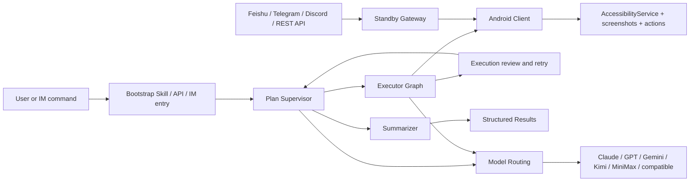

<p align="center">
  <strong>Language:</strong> <a href="./README.md">English</a> | <a href="./README.zh-CN.md">简体中文</a> | <a href="./README.ja-JP.md">日本語</a>
</p>

<p align="center">
  
</p>

<p align="center">
  <a href="#use-opengui-in-deepseek-harness"></a>
  <a href="./skills/open-gui-bootstrap/SKILL.md"></a>
  
  
  
  <a href="./docs/get-started.md"></a>
</p>

<p align="center">
  <strong>A mobile GUI agent framework for Android.</strong>
</p>

<p align="center">
  OpenGUI helps AI agents see, understand, and operate Android app interfaces on real devices.
</p>

<p align="center">
  <strong>⚡ This is the <a href="./docs/OPENGUI-PLUS.md">OpenGUI-Plus</a> enhanced fork</strong> — 10 decoupled DSH-plugin modules (wireless debugging, snippet library, action templates, scheduler, project groups, demo recording, workflow marketplace, feedback RL, device pool, execution replay) layered on top of OpenGUI <em>without modifying the upstream core</em>. See <a href="./docs/OPENGUI-PLUS.md">the enhanced-edition docs</a>.
</p>

<p align="center">
  <strong>Recommended: use OpenGUI directly in DeepSeek Harness.</strong><br>
  Paste one prompt into Codex. It downloads the verified plugin, installs it into DSH, and opens DSH. No full backend deployment is required.
</p>

## OpenGUI-Plus: What the Enhanced Edition Adds

OpenGUI-Plus is more than a renamed fork. It adds a **standalone, persistent, composable DSH-plugin workbench** on top of the Android GUI Agent. All 10 modules live under `deepseek-harness-plugin/opengui-plus/`, communicate through a small module/event boundary, and leave the upstream OpenGUI core untouched.

| # | Module | What you can do | Why it matters |
|---|---|---|---|
| 1 | **Wireless debugging** `wlan-connection` | Connect over USB, WiFi, or auto mode; save devices; inspect live status; pair Android 11+ devices | Stop re-entering endpoints and manually switching transports |
| 2 | **Snippet library** `snippet-library` | Give long commands aliases, tags, and autocomplete; import/export JSON | Turn repetitive ADB / GUI commands into reusable, portable building blocks |
| 3 | **Action templates** `action-template` | Record multi-step actions, extract `{{variables}}`, and run with parameters | Convert one-off manual work into repeatable automation |
| 4 | **Scheduler** `scheduler` | Run one-shot, daily, weekly, or Cron jobs against snippets, templates, or flows | Automate inspections, batches, and recurring mobile operations |
| 5 | **Project / action groups** `project-group` | Switch a complete set of devices, templates, snippets, and schedules; duplicate or import/export it | Keep client projects isolated and switch context in one action |
| 6 | **AI demo recorder** `demo-recorder` | Record a canonical operation, capture AI decisions, revise the demonstration, and convert it to a template | Turn “how a human does it” into reusable AI teaching data |
| 7 | **Workflow marketplace** `workflow-marketplace` | Browse, rate, install, publish, import/export `.opengui-workflow` files, and run workflows | Package and share workflows instead of rebuilding them per device |
| 8 | **Human-feedback RL loop** `feedback-rl` | Record good/bad judgments and reasons, build an experience base, retrieve relevant lessons, track success rate | Make every human review useful to the next execution |
| 9 | **Multi-device pool** `device-pool` | Register devices, group/tag them, set concurrency, queue and prioritize work, auto-assign idle devices | Scale batches without manually choosing a phone for every task |
| 10 | **Execution replay** `replay` | Capture frames, screenshots, AI decisions, anomalies, and recovery; export standalone HTML / JSON | See exactly where a run failed and share the evidence |

### One complete enhancement workflow

```text
Connect device → Save snippets → Record action template → Demonstrate/revise → Schedule or batch-run
       ↑                                                               ↓
Switch project ← Feedback experience base ← Replay failure ← Device pool ← Workflow marketplace
```

### See it in 30 seconds

```bash
cd deepseek-harness-plugin/opengui-plus
npm install
npm run build
node lib/cli.js modules                       # list all 10 modules
node lib/cli.js call wlan-connection.status   # inspect connection state
node lib/cli.js call snippet-library.complete --prefix sc
node lib/cli.js call replay.listReplays       # inspect execution replays
node lib/cli.js serve --port 8787             # launch the visual console
```

The console puts all 10 modules in one page. Data is persisted under `~/.opengui-plus` by default, survives restarts, and is isolated per project group. See the [full OpenGUI-Plus guide](./docs/OPENGUI-PLUS.md) for every method, input, and example.

## Demo

<p align="center">
  
</p>

OpenGUI reads a real Android app UI, plans the next step, takes mobile actions, and returns structured results.

## Use OpenGUI in DeepSeek Harness

The shortest path on macOS is to let Codex run the stable installer Skill from `main`. Each run resolves the latest stable OpenGUI plugin release, while an explicit version remains available for rollback. It requires Node.js 22.19+ or 24+ and installs the compatible DSH version automatically. Paste this as one prompt:

```text
Install and run the OpenGUI installer Skill from https://github.com/Core-Mate/OpenGUI/tree/main/deepseek-harness-plugin/skills/opengui-coremate-install for my DSH web profile. Install the latest stable release. Proceed autonomously, and only pause when I need to authorize or select a phone, add or select a DSH workspace, or provide fallback visual-model credentials.
```

The Skill downloads the public release package and checksum, verifies SHA-256, installs only the OpenGUI plugin, starts DSH when needed, and opens DSH. It preserves unrelated DSH plugins and settings. The installer reports whether it reloaded a managed DSH or whether you need to quit an existing process and rerun it. For Linux or Windows, use the [manual package guide](./deepseek-harness-plugin/README.md#1-download-the-release-package).

OpenGUI supports DSH `0.1.0-rc.7`, `0.1.0-rc.8`, `0.1.1-rc.1`, and `0.1.1-rc.2`; new installs default to `0.1.1-rc.2`. The macOS installer reuses a `PATH` runtime only when it exactly matches the selected version, otherwise it installs an isolated managed runtime under the OpenGUI DSH home. Use `--dsh-version VERSION` to select a supported version. DSH `0.1.2-alpha.4` is not supported. Existing DSH installations, workspaces, model settings, credentials, and phone authorizations are preserved. DSH `0.1.0` RCs cannot read the versioned credential store written by DSH `0.1.1` RCs, so the installer refuses that state downgrade before changing any files and recommends a separate DSH home.

After installation, add or select a DSH workspace, connect and select an authorized Android phone, then send:

```text
@OpenGUI Open Settings and report the Android version
```

The plugin adds phone and browser operation to DSH without requiring the full OpenGUI backend stack. See more [use cases](./deepseek-harness-plugin/docs/use-cases.md) or download the [v0.1.13 release package](https://github.com/Core-Mate/OpenGUI/releases/tag/dsh-coremate-mobile-v0.1.13).

Good fits include:

- automated UI operation and regression testing on authorized devices
- social media management and lead research, with human confirmation before publishing, messaging, or account changes
- repetitive game testing and in-game workflows where the account owner and game rules permit automation

For GUI execution, our current recommendation order is:

| Priority | Model family | Guidance |
|---|---|---|
| 1 | Doubao VLM | Recommended first for visual GUI execution. |
| 2 | Qwen VLM | A practical alternative, but some social media prompts may be more sensitive to model safety policies. |
| 3 | OpenAI vision-capable models | Capable, but generally the higher-cost option for screenshot-heavy tasks. |
| 4 | Grok vision-capable models | Experimental for this workflow; tool use and action reliability still need more validation. |

Model availability, pricing, and policy behavior vary by version and region. Whichever provider you choose, the model must support both image input and tool calling.

## Run the Full OpenGUI Stack

To run the full OpenGUI backend and Android client, let Claude Code, Codex, or OpenCode bootstrap it for you.

```text
Read ./skills/open-gui-bootstrap/SKILL.md and help me run OpenGUI. Only ask me for phone-side actions.
```

This explicit prompt also works in OpenCode. The repository keeps the Skill in
`skills/`, so OpenCode users should include the path as shown instead of relying
on automatic Skill discovery. See the [OpenCode Agent Skills documentation](https://opencode.ai/docs/skills/)
for its native `.opencode/skills/` and `.agents/skills/` locations.

Root access and an unlocked bootloader are not required. OpenGUI uses standard
Android `AccessibilityService` APIs for screenshots and actions. ADB is used
only to install and launch the APK and configure local port forwarding with
`adb reverse`; it does not root the device or modify the Android system.

You will need:

- an Android 11 (API 30) or newer phone or emulator
- USB debugging enabled
- AccessibilityService enabled
- overlay permission and battery optimization exemption enabled
- model API keys for real task execution

Permission names and menu locations vary across Android vendors. Complete the
[Android permission setup guide](./docs/android-permissions.md) before running
the first task.

OpenGUI will use the repository scripts to start the backend and install the Android client:

```bash
cd server
./start.sh
```

```bash
cd client
./start.sh
```

After the backend and Android client are running, send a first task:

```bash
cd server
pnpm opengui -- devices --json
pnpm opengui -- do "Observe the current Android screen and summarize what you see" --json
```

`do` starts the execution asynchronously and returns after the execution is
created; it does not stream progress or wait for completion. The response
includes an `executionId`. Use it to check the current status:

```bash
pnpm opengui -- status <executionId> --json
```

`status` returns one snapshot, so run it again whenever you want an update.
Check `executionStatus` and, when present, `statusMessage`, `currentStep`,
`executionResult`, or `errorMessage`. `PENDING` means the execution is waiting
to start on the phone, `RUNNING` means it is active, and `FINISHED` means it has
completed. Fine-grained fields are not always present, so a `RUNNING` snapshot
may not distinguish a model wait from a phone wait. If `do` itself does not
return an `executionId`, treat that as a request or startup problem rather than
normal asynchronous execution. Keep the same `executionId` if you need to stop
the active task:

```bash
pnpm opengui -- cancel <executionId> --json
```

Manual setup guide: [`docs/get-started.md`](./docs/get-started.md).

## Recent Updates

- `[2026.5.16]` Added [Codex / Claude Code remote control](./docs/codex-remote-control.md) with a local REST API, `pnpm opengui -- ...` CLI, and the [`open-gui-remote-control`](./skills/open-gui-remote-control/SKILL.md) Skill for dispatching Android app tasks from coding agents.
- `[2026.5.9]` Added a [Discord IM channel](./docs/DISCORD.md) for remote Android task dispatch, including prefix commands, slash commands, allowlists, and guild-scoped command registration.
- `[2026.5.7]` Hardened local startup to avoid common PostgreSQL and Redis port conflicts during Docker-based backend setup.
- `[2026.5.1]` Improved backend onboarding with `.env.example`, startup checks, and graph-agent VLM environment configuration.

## What You Can Do with OpenGUI

OpenGUI provides an Android GUI agent stack for screen understanding, task planning, action execution, review, and recovery.

You can use the same repository in four practical ways:

- **Operate mainstream Android apps**: let AI handle mobile tasks inside X, Reddit, Hacker News, Telegram, WeChat, Weibo, Xiaohongshu, and other Android apps on a real phone.
- **Run shipped workflows**: the repository already includes a runnable backend, Android client, standby dispatch path, and a set of built-in task capabilities.
- **Let an AI coding agent bootstrap it for you**: point Claude Code, Codex, or OpenCode at [`skills/open-gui-bootstrap/SKILL.md`](./skills/open-gui-bootstrap/SKILL.md), describe the goal in plain language, and let it handle setup, build, install, and local debugging.
- **Let an AI coding agent control Android apps**: after OpenGUI is running, point Claude Code, Codex, or OpenCode at [`skills/open-gui-remote-control/SKILL.md`](./skills/open-gui-remote-control/SKILL.md) to list devices, dispatch tasks, and track executions through the local CLI.
- **Operate phones as remote workers**: dispatch tasks through Feishu, Telegram, Discord, or REST API, keep devices on standby, and get structured results back from the backend.

- [Join the Discord community](https://discord.gg/pqHHw7XgJ3)

## Highlights

- **Built for long-running tasks**: OpenGUI is shaped for mobile workflows that may run for hours, with progress, review, and recovery kept inside the system.
- **Plan before action, summarize after execution**: before touching an app, OpenGUI breaks the goal into executable steps; after the run, it returns a structured summary of what happened, what worked, and what still needs attention.
- **The task can keep moving**: `Plan Supervisor` maintains task state and continuation, `Executor Graph` runs screenshot, vision, action, and call-user loops on top of live device state, and `Summarizer` closes the run with a structured result.
- **Phones can stay on standby**: the standby dispatch path lets devices receive remote work through Feishu, Telegram, Discord, or REST entry points.
- **Models can be assigned by role**: model routing separates planning from VLM execution so teams can choose providers by job.
- **The system is organized around real mobile workflows**: the graph, device execution path, and model split already exist in the source tree.

## Why OpenGUI Is Different

OpenGUI is built as a mobile operator system with explicit orchestration layers.

The source code currently exposes these pieces:

- `server/apps/backend/src/modules/graph-agent/graph/mobile-agent.graph.ts` for the main graph
- `server/apps/backend/src/modules/graph-agent/graph/executor.graph.ts` for the device-side execution loop
- `server/apps/backend/src/common/ws/standby.gateway.ts` for standby device dispatch
- `client/core_network/.../StandbySocketManager.kt` for persistent device standby connections
- `client/core_accessibility/.../GestureService.kt` for Android-side action execution

| Dimension | Typical phone-agent demo | OpenGUI |
|---|---|---|
| **Execution model** | Short interactive loop | Main graph plus executor subgraph |
| **Task state** | Usually local and session-bound | Task state managed in the backend graph |
| **Device path** | Often laptop-driven control | Android client with standby and execution sockets |
| **Model usage** | One model does most of the work | Planning and VLM paths can be split across providers |
| **Remote operation** | Optional add-on | Feishu, Telegram, Discord, REST API, and standby dispatch are built into the backend |

## Typical Use Cases

- Open X and collect recent posts for a topic
- Read and summarize Reddit or Hacker News threads on a live phone
- Trigger Android tasks remotely from Feishu, Telegram, Discord, or REST API
- Execute repetitive mobile workflows on Android devices
- Run long mobile workflows that need state, review, and recovery over many hours

## Current Limitations

- Requires an Android 11 (API 30) or newer device or emulator.
- Requires USB debugging and AccessibilityService permissions.
- Execution quality depends on the model, app UI, network state, and task length.
- Not an always-on OS-level assistant yet; tasks are currently triggered manually or through configured dispatch channels.
- Long-running tasks are supported by the system design, but reliability still needs more real-world testing.
- More ready-to-run task examples and benchmarks are still needed.

## Roadmap

- Add a short demo video and more real app examples.
- Improve one-command local setup.
- Add more ready-to-run phone-use task templates.
- Improve execution recovery and failure reporting.
- Add benchmark tasks for Android GUI agent reliability.
- Expand docs for model configuration and cost-saving profiles.
- Launch a hosted OpenGUI Agent service for teams that want GUI operation without running the full stack themselves.

## How to Use OpenGUI

### 1. With Claude Code, Codex, or OpenCode

Start with [`skills/open-gui-bootstrap/SKILL.md`](./skills/open-gui-bootstrap/SKILL.md).

The intended flow is simple:

1. point Claude Code, Codex, or OpenCode at the skill
2. describe the task in plain language
3. let the model handle backend bootstrap, APK build, install, and local debugging

It should only stop for:

- connecting a phone or starting an emulator
- approving USB debugging
- enabling AccessibilityService
- granting overlay or battery permissions
- providing API keys or bot credentials

After the backend and Android client are running, use [`skills/open-gui-remote-control/SKILL.md`](./skills/open-gui-remote-control/SKILL.md) to let Claude Code, Codex, or OpenCode control the phone through the local CLI:

```bash
cd server
pnpm opengui -- devices --json
pnpm opengui -- do "Observe the current Android screen and summarize what you see" --json
pnpm opengui -- status <executionId> --json
pnpm opengui -- cancel <executionId> --json
```

Recommended profiles:

#### High-performance profile

Use the latest Claude Opus model family across planning, supervision, review, and vision when you want the strongest overall quality.

This is the easiest way to get the best execution quality, and it is the most expensive path.

#### Cost-saving mixed profile

Use **Qwen 3.6 Plus** for text-side roles such as Planner and Supervisor, and use **Doubao Pro** for the VLM side.

This usually preserves the overall system shape while lowering model cost by roughly **10x to 15x** compared with an all-Opus setup, depending on task length, screenshot volume, and token mix.

Recommended prompts:

#### Run it

```text
Read ./skills/open-gui-bootstrap/SKILL.md and help me run OpenGUI. Only ask me for phone-side actions.
```

#### Use Claude Opus everywhere

```text
Read ./skills/open-gui-bootstrap/SKILL.md and bootstrap OpenGUI with the latest Claude Opus model family for planning, supervision, review, and vision.
```

#### Use Qwen + Doubao to save cost

```text
Read ./skills/open-gui-bootstrap/SKILL.md and set up OpenGUI with Qwen 3.6 Plus for Planner and Supervisor, and Doubao Pro for VLM execution.
```

#### Use my own APIs

```text
Read ./skills/open-gui-bootstrap/SKILL.md and use my existing model APIs to get OpenGUI working.
```

### 2. Manual setup

Use the repository scripts directly:

```bash
cd server
./start.sh
```

```bash
cd client
./start.sh
```

Reference docs:

- [docs/get-started.md](./docs/get-started.md)
- [server/start.sh](./server/start.sh)
- [client/start.sh](./client/start.sh)
- [server/apps/backend/README.md](./server/apps/backend/README.md)
- [docs/DISCORD.md](./docs/DISCORD.md)
- [client/README.md](./client/README.md)

### 3. Optional Discord remote control

Discord can be enabled as an optional IM channel. A Discord bot receives commands
such as `!opengui devices` or `!opengui do ...`, then the backend dispatches the
task to a standby Android phone and posts progress back to the same channel.

This is not required for local use. If `DISCORD_BOT_TOKEN` is empty, the backend
starts normally and skips Discord.

Full setup guide: [docs/DISCORD.md](./docs/DISCORD.md).

## The System



### Core Runtime Pieces

- **Backend graph**: `server/apps/backend/src/modules/graph-agent/graph/`
- **Task APIs**: `server/apps/backend/src/modules/task/task.controller.ts`
- **Standby dispatch**: `server/apps/backend/src/common/ws/standby.gateway.ts`
- **IM channel dispatch**: `server/apps/backend/src/modules/im-channel/`
- **Android standby connection**: `client/core_network/src/main/java/com/coremate/opengui/network/websocket/StandbySocketManager.kt`
- **Android execution path**: `client/core_accessibility/src/main/java/com/coremate/opengui/accessibility/GestureService.kt`

## Documentation

- [skills/open-gui-bootstrap/SKILL.md](./skills/open-gui-bootstrap/SKILL.md)
- [docs/get-started.md](./docs/get-started.md)
- [server/apps/backend/README.md](./server/apps/backend/README.md)
- [docs/DISCORD.md](./docs/DISCORD.md)
- [client/README.md](./client/README.md)
- [CONTRIBUTING.md](./CONTRIBUTING.md)
- [SECURITY.md](./SECURITY.md)
- [CLAUDE.md](./CLAUDE.md)

## Community / Support

Join the [OpenGUI Discord community](https://discord.gg/pqHHw7XgJ3) to discuss GUI agent development, share real use cases, and get release updates. A verified WeChat community entry will be published here when it is ready.

Community members will also be able to apply for trial Agent credits when the hosted OpenGUI Agent service opens. Availability, eligibility, and validity will be announced with the service.

The most useful project feedback is:

- open issues for bugs and feature requests
- share real use cases and deployment feedback
- contribute docs, integrations, and fixes

## License

OpenGUI is source-available under the Business Source License 1.1 (BUSL-1.1).

You may copy, modify, distribute, and use the source for non-production purposes. Production use, commercial use, hosted services, and integration into commercial products require a separate commercial license from Core-Mate.

For this version:

- Change Date: 2030-04-29
- Change License: Apache License, Version 2.0

This is public source, but it is not OSI-approved open source until the Change Date.

See [LICENSE](./LICENSE).
