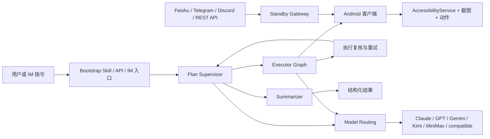

<p align="center">
  <strong>语言切换：</strong><a href="./README.md">English</a> | <a href="./README.zh-CN.md">简体中文</a> | <a href="./README.ja-JP.md">日本語</a>
</p>

<p align="center">
  
</p>

<p align="center">
  <a href="#在-deepseek-harness-中使用-opengui"></a>
  <a href="./skills/open-gui-bootstrap/SKILL.md"></a>
  
  
  
  <a href="./docs/get-started.zh-CN.md"></a>
</p>

<p align="center">
  <strong>面向 Android 的移动端 GUI Agent 框架。</strong>
</p>

<p align="center">
  OpenGUI 让 AI Agent 能够看懂、理解并操作真实 Android 设备上的 App 界面。
</p>

<p align="center">
  <strong>⚡ 这是 <a href="./docs/OPENGUI-PLUS.zh-CN.md">OpenGUI-Plus</a> 增强版</strong> —— 在 OpenGUI 之上以「解耦 DSH 插件」形式叠加 10 个模块（无线调试、快捷指令库、动作模板、定时任务、项目组、演示录制、工作流市场、反馈强化学习、设备池、执行回放），<em>不改动上游核心代码</em>。详见 <a href="./docs/OPENGUI-PLUS.zh-CN.md">增强版使用文档</a>。
</p>

<p align="center">
  <strong>推荐：直接在 DeepSeek Harness 中使用 OpenGUI。</strong><br>
  只需把一段话发给 Codex，它会下载并校验插件、安装到 DSH，再打开 DSH，不需要先部署完整后端。
</p>

## OpenGUI-Plus 新增能力（重点）

OpenGUI-Plus 不是只改了仓库名字：它在原有 Android GUI Agent 之上，新增了一套**可独立运行、可持久化、可组合的 DSH 插件工作台**。下面 10 个模块都位于 `deepseek-harness-plugin/opengui-plus/`，互相解耦，不修改上游 OpenGUI 核心代码。

| # | 模块 | 你可以直接做什么 | 解决的实际问题 |
|---|---|---|---|
| 1 | **无线调试连接** `wlan-connection` | USB / WiFi / 自动连接，保存设备，查看实时状态，Android 11+ 配对 | 不再反复输入设备地址，也不用手动切换 USB 与无线调试 |
| 2 | **快捷指令库** `snippet-library` | 给长指令设置别名、标签和自动补全，JSON 导入导出 | 常用 ADB / GUI 指令可复用、可迁移、可搜索 |
| 3 | **动作模板录制** `action-template` | 录制多步动作，自动提取 `{{变量}}`，传参后一键执行 | 把一次性的手工操作变成可重复的自动化模板 |
| 4 | **定时任务** `scheduler` | 单次、每天、每周、Cron 调度，执行指令 / 模板 / 流程并记录日志 | 巡检、批处理和周期性操作无需人工盯着 |
| 5 | **动作组 / 项目组** `project-group` | 一键切换设备、模板、指令和调度的整套配置，支持复制和导入导出 | 工作项目之间不串配置，换项目不用逐项重配 |
| 6 | **AI 演示与教学录制** `demo-recorder` | 录制标准操作、记录 AI 决策、修正示范、升级修订版本、转成模板 | 把“人怎么做”沉淀成 AI 可以复用的示范 |
| 7 | **工作流模板市场** `workflow-marketplace` | 浏览、评分、安装、发布、导入导出 `.opengui-workflow`、一键运行 | 工作流可以打包分享，不必每台设备重新搭建 |
| 8 | **人类反馈强化学习** `feedback-rl` | 记录正确 / 错误评价和原因，沉淀经验，按现象检索，统计成功率 | 每次人工复核都能变成下一次执行的参考经验 |
| 9 | **多机设备池** `device-pool` | 注册多台设备，按标签分组，设置并发，任务排队、优先级和自动分配 | 批量任务不再手工挑设备，空闲设备自动接活 |
| 10 | **执行可视化回放** `replay` | 逐帧记录动作、截图、AI 决策、异常恢复，导出单文件 HTML / JSON | 失败后能定位是哪一步出错，也能把执行过程分享给别人 |

### 一条完整的增强工作流

```text
连接设备 → 保存快捷指令 → 录制动作模板 → 演示/修正 → 定时或批量执行
    ↑                                                ↓
项目组切换 ← 反馈经验库 ← 失败回放 ← 多机设备池 ← 工作流模板市场
```

### 30 秒看效果

```bash
cd deepseek-harness-plugin/opengui-plus
npm install
npm run build
node lib/cli.js modules                       # 查看 10 个模块
node lib/cli.js call wlan-connection.status   # 查看设备连接状态
node lib/cli.js call snippet-library.complete --prefix sc
node lib/cli.js call replay.listReplays       # 查看执行回放
node lib/cli.js serve --port 8787             # 打开可视化控制台
```

控制台会把 10 个模块集中到一个页面；数据默认保存在 `~/.opengui-plus`，跨会话保留，并按项目组隔离。完整方法列表、参数和示例请看 [OpenGUI-Plus 增强版使用文档](./docs/OPENGUI-PLUS.zh-CN.md)。

## Demo

<p align="center">
  
</p>

OpenGUI 会读取真实 Android App 界面，规划下一步操作，执行移动端动作，并返回结构化结果。

第一次使用 DSH 插件时，可先阅读 [OpenGUI × DeepSeek Harness 简明说明与 FAQ](./deepseek-harness-plugin/docs/quick-start-and-faq.zh.md)。

## 在 DeepSeek Harness 中使用 OpenGUI

macOS 上最短的路径，是让 Codex 运行 `main` 分支上的稳定安装 Skill。每次执行时，安装器都会解析并安装最新正式版 OpenGUI 插件，同时保留指定版本参数用于回滚。环境需要 Node.js 22.19+ 或 24+，兼容的 DSH 版本会自动安装。把下面整段作为一条消息发给 Codex：

```text
请安装并运行这个 OpenGUI 安装 Skill：https://github.com/Core-Mate/OpenGUI/tree/main/deepseek-harness-plugin/skills/opengui-coremate-install，把最新正式版插件安装到我的 DSH web profile。请自主完成安装，仅在需要我授权或选择手机、添加或选择 DSH workspace，或者提供备用视觉模型凭据时暂停并询问我。
```

Skill 会下载公开 Release 的插件包和校验文件，验证 SHA-256，只安装 OpenGUI 插件，在需要时启动并打开 DSH，同时保留其他 DSH 插件和设置。安装器会说明它是否已重启受管理的 DSH，或者是否需要先退出已有进程再重新运行。Linux 或 Windows 用户可按[手动安装说明](./deepseek-harness-plugin/README.zh.md#1-下载发布包)操作。

OpenGUI 正式支持 DSH `0.1.0-rc.7`、`0.1.0-rc.8`、`0.1.1-rc.1` 和 `0.1.1-rc.2`，新安装默认使用 `0.1.1-rc.2`。macOS 安装器只会复用与所选版本完全一致的 `PATH` runtime，否则会在 OpenGUI 的 DSH home 下安装隔离的 managed runtime；可用 `--dsh-version VERSION` 选择受支持版本。DSH `0.1.2-alpha.4` 暂不支持。现有 DSH、工作区、模型设置、凭据和手机授权都不会被替换。DSH `0.1.0` RC 无法读取 DSH `0.1.1` RC 写入的新版凭据格式，因此安装器会在改动任何文件前拒绝这种状态降级，并提示改用独立的 DSH home。

安装完成后，在 DSH 中添加或选择工作区，连接并选择已授权的 Android 手机，然后发送：

```text
@OpenGUI 打开设置并报告 Android 版本
```

插件可以直接为 DSH 增加手机与浏览器操作能力，不需要部署完整的 OpenGUI 后端。你还可以查看更多[使用场景](./deepseek-harness-plugin/docs/use-cases.zh.md)，或下载 [v0.1.13 安装包](https://github.com/Core-Mate/OpenGUI/releases/tag/dsh-coremate-mobile-v0.1.13)。

适合的使用场景包括：

- 在已授权设备上执行自动化操作测试和回归测试
- 管理社媒账号和挖掘线索，在发布、私信或修改账号前由人工确认
- 在账号所有者和游戏规则允许自动化的前提下，执行重复性游戏测试和游戏内流程

针对 GUI 操作，我们目前的模型推荐顺序是：

| 优先级 | 模型系列 | 使用建议 |
|---|---|---|
| 1 | 豆包 VLM | 视觉 GUI 操作的首选。 |
| 2 | 千问 VLM | 可作为备选，但部分社媒任务更容易受到模型安全策略限制。 |
| 3 | OpenAI 视觉模型 | 能力可用，但截图密集型任务的成本通常更高。 |
| 4 | Grok 视觉模型 | 目前作为实验选项，工具调用和操作稳定性还需要更多验证。 |

具体模型的可用性、价格和策略会随版本及地区变化。无论选择哪家模型，都需要同时支持图片输入和工具调用。

## 运行完整 OpenGUI 技术栈

如果要运行完整的 OpenGUI 后端和 Android 客户端，可以让 Claude Code、Codex 或 OpenCode 帮你完成启动。

```text
Read ./skills/open-gui-bootstrap/SKILL.md and help me run OpenGUI. Only ask me for phone-side actions.
```

这段显式指定 Skill 路径的提示词同样适用于 OpenCode。当前仓库把 Skill 放在顶层 `skills/` 目录，因此 OpenCode 用户应像上面一样明确提供路径，而不是依赖自动发现。OpenCode 原生支持的 `.opencode/skills/` 和 `.agents/skills/` 目录可参考其 [Agent Skills 文档](https://opencode.ai/docs/skills/)。

无需 Root，也无需解锁 Bootloader。OpenGUI 使用 Android 标准的 `AccessibilityService` API 获取截图，并执行点击、滑动、输入、返回和主页等操作。ADB 仅用于在本地安装和启动 APK，以及通过 `adb reverse` 配置端口转发；它不会 Root 或修改设备系统。

你需要准备：

- 一台 Android 11（API 30）或更高版本的手机或模拟器
- 已开启 USB 调试
- 已开启无障碍服务（AccessibilityService）
- 已开启悬浮窗权限，并允许 OpenGUI 忽略电池优化
- 用于真实任务执行的模型 API Key

不同 Android 品牌使用的权限名称和设置入口并不一致。运行第一个任务前，请完成
[Android 权限配置指南](./docs/android-permissions.zh-CN.md)中的检查清单。

OpenGUI 会使用仓库内脚本启动后端，并安装 Android 客户端：

```bash
cd server
./start.sh
```

```bash
cd client
./start.sh
```

后端和 Android 客户端都跑起来后，发送第一个任务：

```bash
cd server
pnpm opengui -- devices --json
pnpm opengui -- do "观察当前手机屏幕，简要描述你看到了什么，然后结束" --json
```

`do` 会异步启动 execution，并在创建完成后返回；它不会持续输出进度，也不会等待任务结束。响应中会包含 `executionId`，使用它查询当前状态：

```bash
pnpm opengui -- status <executionId> --json
```

`status` 每次返回一个状态快照，需要更新时可以再次执行。请查看 `executionStatus`，以及返回结果中存在的 `statusMessage`、`currentStep`、`executionResult` 或 `errorMessage`。`PENDING` 表示 execution 正在等待手机端启动，`RUNNING` 表示正在执行，`FINISHED` 表示已经结束。细粒度字段不一定始终存在，因此 `RUNNING` 状态不一定能区分当前是在等待模型还是等待手机。如果 `do` 本身没有返回 `executionId`，应将其视为请求或启动异常，而不是正常的异步执行。需要停止正在执行的任务时，继续使用同一个 `executionId`：

```bash
pnpm opengui -- cancel <executionId> --json
```

手动安装指南：[`docs/get-started.zh-CN.md`](./docs/get-started.zh-CN.md)。

## 近期更新

- `[2026.5.16]` 新增 [Codex / Claude Code 远程控制](./docs/codex-remote-control.zh-CN.md)，提供本地 REST API、`pnpm opengui -- ...` CLI，以及 [`open-gui-remote-control`](./skills/open-gui-remote-control/SKILL.md) Skill，可从编码 Agent 下发 Android App 任务。
- `[2026.5.9]` 新增 [Discord IM 入口](./docs/DISCORD.zh-CN.md)，支持前缀命令、Slash 命令、安全白名单和 guild-scoped 命令注册，可从 Discord 频道远程下发 Android 任务。
- `[2026.5.7]` 本地启动流程增强，Docker 方式启动后端时会避开常见的 PostgreSQL 和 Redis 端口冲突。
- `[2026.5.1]` 后端上手流程补齐 `.env.example`、启动检查提示和 graph agent 的 VLM 环境变量配置。

## 你可以用 OpenGUI 做什么

OpenGUI 让 AI 操作真实的 Android 手机。

同一个仓库里，你可以直接做四类事情：

- **操作主流 Android App**：让 AI 在真实手机上执行 X、Reddit、Hacker News、Telegram、微信、微博、小红书等移动任务。
- **运行现成工作流**：仓库已经包含可直接启动的后端、Android 客户端、待命派发链路，以及部分预置任务能力。
- **让 AI 编码 Agent 帮你跑起来**：把 [`skills/open-gui-bootstrap/SKILL.md`](./skills/open-gui-bootstrap/SKILL.md) 交给 Claude Code、Codex 或 OpenCode，直接用自然语言描述目标，让它处理安装、构建、安装 APK 和本地排障。
- **让 AI 编码 Agent 控制 Android App**：OpenGUI 启动后，把 [`skills/open-gui-remote-control/SKILL.md`](./skills/open-gui-remote-control/SKILL.md) 交给 Claude Code、Codex 或 OpenCode，用本地 CLI 列设备、下发任务并查询 execution 状态。
- **把手机当成远程 worker 使用**：通过飞书、Telegram、Discord 或 REST API 下发任务，让设备保持待命，并从后端拿回结构化结果。
- [加入 Discord 社区](https://discord.gg/pqHHw7XgJ3)

## 亮点

- **适合长时任务**：OpenGUI 面向长时移动工作流，任务可以持续运行数小时，并在过程中继续推进、复核和恢复。
- **先规划，再执行，最后总结**：在真正操作 App 前，OpenGUI 会先把目标拆成可执行步骤；任务结束后，会返回结构化总结，说明完成了什么、哪里失败、下一步该怎么处理。
- **任务能持续跑下去**：`Plan Supervisor` 维护任务列表和继续执行状态，`Executor Graph` 围绕当前设备状态运行截图、视觉分析、动作执行和 call-user 循环，`Summarizer` 在任务结束时输出结构化结果。
- **手机可以保持待命**：待命派发链路让设备可以通过飞书、Telegram、Discord 或 REST 入口接收远程任务。
- **模型可以按角色分工**：模型路由把规划侧和 VLM 执行侧拆开，便于按角色选择 provider。
- **整套系统围绕真实移动工作流组织**：graph、设备执行链路和模型分工已经在源码里落地。

## 为什么 OpenGUI 不一样

OpenGUI 采用的是一套分层清晰的移动 operator system。

当前源码里可以直接看到这些关键部分：

- `server/apps/backend/src/modules/graph-agent/graph/mobile-agent.graph.ts` 主图
- `server/apps/backend/src/modules/graph-agent/graph/executor.graph.ts` 设备执行子图
- `server/apps/backend/src/common/ws/standby.gateway.ts` 待命设备派发
- `client/core_network/.../StandbySocketManager.kt` 设备待命连接
- `client/core_accessibility/.../GestureService.kt` Android 侧动作执行

| 维度 | 典型手机 Agent Demo | OpenGUI |
|---|---|---|
| **执行模型** | 短时交互循环 | 主图 + executor 子图 |
| **任务状态** | 常常停留在本地会话里 | 任务状态由后端 graph 持有 |
| **设备链路** | 常见是电脑侧驱动手机 | Android 客户端自带待命与执行连接 |
| **模型使用** | 一个主模型承担大部分工作 | 规划和 VLM 执行可以拆给不同 provider |
| **远程运行** | 往往是附加能力 | 飞书、Telegram、Discord、REST API、待命派发已经在后端里 |

## 典型使用场景

- 打开 X 并采集某个主题的近期内容
- 在真实手机上阅读并总结 Reddit 或 Hacker News 帖子
- 从飞书、Telegram、Discord 或 REST API 远程触发手机任务
- 在 Android 设备上执行重复性的移动工作流
- 运行需要状态管理、复核和恢复机制的长时移动工作流

## 当前限制

- 需要 Android 11（API 30）或更高版本的真机或模拟器。
- 需要开启 USB 调试和 AccessibilityService 权限。
- 执行质量会受到模型能力、App UI、网络状态和任务长度影响。
- 目前还不是 OS 级常驻助手；任务需要手动触发，或通过已配置的派发入口触发。
- 系统设计支持长时任务，但可靠性仍需要更多真实场景测试。
- 还需要补充更多可直接运行的任务示例和 benchmark。

## Roadmap

- 补充短 Demo 视频和更多真实 App 示例。
- 优化一键本地启动流程。
- 增加更多可直接运行的 phone-use 任务模板。
- 提升执行恢复和失败反馈能力。
- 增加 Android GUI Agent 可靠性 benchmark 任务。
- 完善模型配置和省钱混用方案文档。
- 推出托管版 OpenGUI Agent 服务，让不想自行部署完整技术栈的团队也能使用 GUI 操作能力。

## 怎么使用 OpenGUI

### 1. 用 Claude Code、Codex 或 OpenCode 帮你跑起来

优先从 [`skills/open-gui-bootstrap/SKILL.md`](./skills/open-gui-bootstrap/SKILL.md) 开始。

推荐流程很简单：

1. 把 Skill 交给 Claude Code、Codex 或 OpenCode
2. 直接用自然语言描述目标
3. 让模型处理后端 bootstrap、APK 构建、安装和本地排障

模型只应该在这些事情上打断你：

- 连接手机或启动模拟器
- 允许 USB 调试
- 开启 AccessibilityService
- 授予悬浮窗或电池权限
- 提供 API Key 或机器人密钥

后端和 Android client 跑起来后，可以继续使用 [`skills/open-gui-remote-control/SKILL.md`](./skills/open-gui-remote-control/SKILL.md)，让 Claude Code、Codex 或 OpenCode 通过本地 CLI 控制手机：

```bash
cd server
pnpm opengui -- devices --json
pnpm opengui -- do "观察当前手机屏幕，简要描述你看到了什么，然后结束" --json
pnpm opengui -- status <executionId> --json
pnpm opengui -- cancel <executionId> --json
```

推荐配置：

#### 高配版

如果你优先要效果，可以把规划、监督、复核和视觉分析都放到最新的 Claude Opus 模型族上。

这条路径最省心，整体质量也最高，同时成本最高。

#### 省钱混用版

如果你优先控制成本，建议把 **Planner**、**Supervisor** 这类文本角色放到 **千问 3.6 Plus**，把 **VLM** 这一侧放到 **豆包 Pro**。

在很多任务里，这种混用方式还能保持整体系统结构，同时把模型成本大致降到全量 Opus 方案的 **1/10 到 1/15**，实际比例会受到任务时长、截图数量和 token 结构影响。

推荐说法：

#### 直接运行

```text
读一下 ./skills/open-gui-bootstrap/SKILL.md，然后帮我把 OpenGUI 跑起来，只在必须时告诉我手机上要做什么。
```

#### 全部使用 Claude Opus

```text
读一下 ./skills/open-gui-bootstrap/SKILL.md，然后用最新的 Claude Opus 模型族来配置 OpenGUI，把规划、监督、复核和视觉分析都放进去。
```

#### 用千问 + 豆包省钱

```text
读一下 ./skills/open-gui-bootstrap/SKILL.md，然后帮我把 OpenGUI 配成：Planner 和 Supervisor 用千问 3.6 Plus，VLM 执行侧用豆包 Pro。
```

#### 使用我自己的 API

```text
读一下 ./skills/open-gui-bootstrap/SKILL.md，然后用我现有的模型 API 把 OpenGUI 跑起来。
```

### 2. 手动安装

直接使用仓库里的脚本：

```bash
cd server
./start.sh
```

```bash
cd client
./start.sh
```

参考文档：

- [docs/get-started.zh-CN.md](./docs/get-started.zh-CN.md)
- [server/start.sh](./server/start.sh)
- [client/start.sh](./client/start.sh)
- [server/apps/backend/README.md](./server/apps/backend/README.md)
- [docs/DISCORD.zh-CN.md](./docs/DISCORD.zh-CN.md)
- [client/README.md](./client/README.md)

### 3. 可选的 Discord 远程控制

Discord 可以作为可选 IM 入口启用。Discord Bot 接收 `!opengui devices` 或
`!opengui do ...` 这类命令，后端再把任务下发给待命 Android 手机，并把进度回传到
同一个 Discord 频道。

这不是本地运行的必选项。`DISCORD_BOT_TOKEN` 为空时，后端会正常启动并跳过
Discord。

完整配置说明见：[docs/DISCORD.zh-CN.md](./docs/DISCORD.zh-CN.md)。

## 系统结构



### 运行时核心部件

- **后端 graph**：`server/apps/backend/src/modules/graph-agent/graph/`
- **任务 API**：`server/apps/backend/src/modules/task/task.controller.ts`
- **待命派发**：`server/apps/backend/src/common/ws/standby.gateway.ts`
- **IM 入口派发**：`server/apps/backend/src/modules/im-channel/`
- **设备待命连接**：`client/core_network/src/main/java/com/coremate/opengui/network/websocket/StandbySocketManager.kt`
- **Android 执行链路**：`client/core_accessibility/src/main/java/com/coremate/opengui/accessibility/GestureService.kt`

## 文档

- [skills/open-gui-bootstrap/SKILL.md](./skills/open-gui-bootstrap/SKILL.md)
- [docs/get-started.zh-CN.md](./docs/get-started.zh-CN.md)
- [server/apps/backend/README.md](./server/apps/backend/README.md)
- [docs/DISCORD.zh-CN.md](./docs/DISCORD.zh-CN.md)
- [client/README.md](./client/README.md)
- [CONTRIBUTING.md](./CONTRIBUTING.md)
- [SECURITY.md](./SECURITY.md)
- [CLAUDE.md](./CLAUDE.md)

## 社区 / 支持

欢迎加入 [OpenGUI Discord 社区](https://discord.gg/pqHHw7XgJ3)，讨论 GUI Agent 技术方向、分享真实使用场景并获取版本动态。经过验证的微信群入口准备好后，也会在这里公开。

托管版 OpenGUI Agent 服务开放后，社区成员还可以申请 Agent 体验额度。具体名额、领取条件和有效期将随服务一同公布。

最有价值的项目反馈包括：

- 提交 bug 和 feature request
- 分享真实使用场景和部署反馈
- 贡献文档、集成和修复

## 许可证

OpenGUI 采用 Business Source License 1.1 (BUSL-1.1)，源码可见。

你可以复制、修改、分发源码，并用于非生产用途。生产使用、商业使用、托管服务、集成到商业产品中，都需要 Core-Mate 的单独商业授权。

当前版本：

- Change Date: 2030-04-29
- Change License: Apache License, Version 2.0

这代表源码公开 / source-available，但在 Change Date 前不是 OSI 批准的许可证。

详见 [LICENSE](./LICENSE)。
